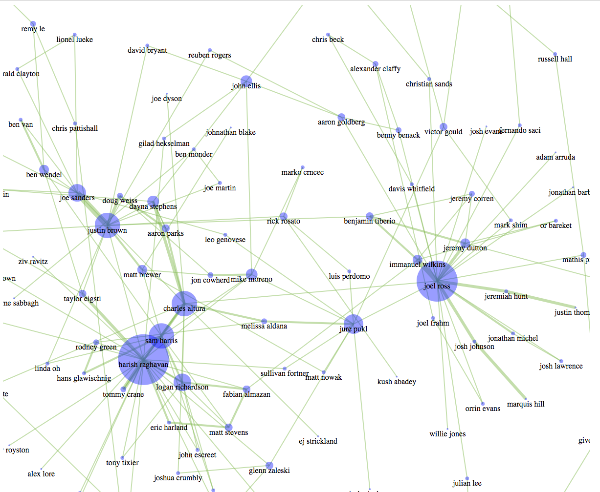
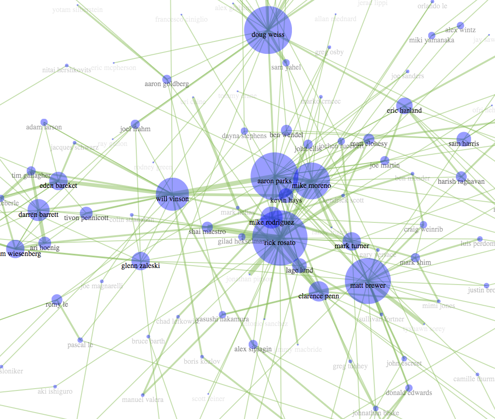
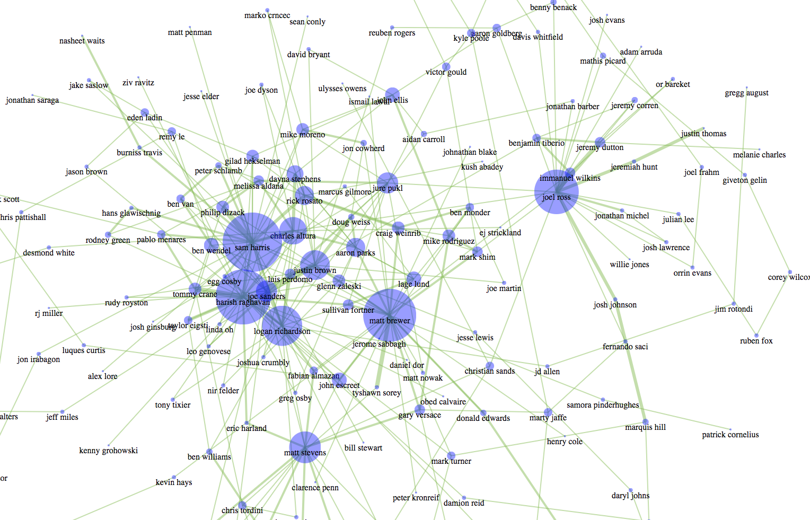

# Smalls-Network-Generator

This project is designed to, given an artist that has played at Smalls jazz club as input, create a network 
of people who play together.

## Building the network
the [python script](/blob/master/networkgen.py) takes an artist as 
a starting point, finds the most recent (about 10) shows they played at smalls, and for those shows, finds the other artists on them, and documents the relationship of those artists to each other by creating or updating weighted edges in an undirected graph. The script will likely output an edgelist/nodelist as a .csv file.
## Visualizing the network (up next)
Given the node/edge list from the script, I created a visualization of this network data with the javascript library [D3.js](d3js.org).

### Examples

