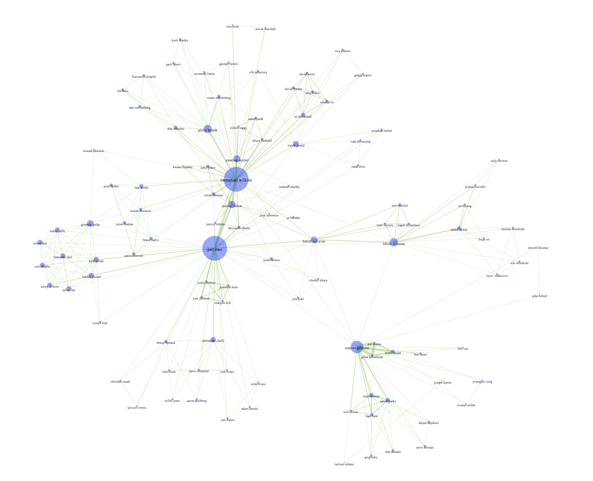
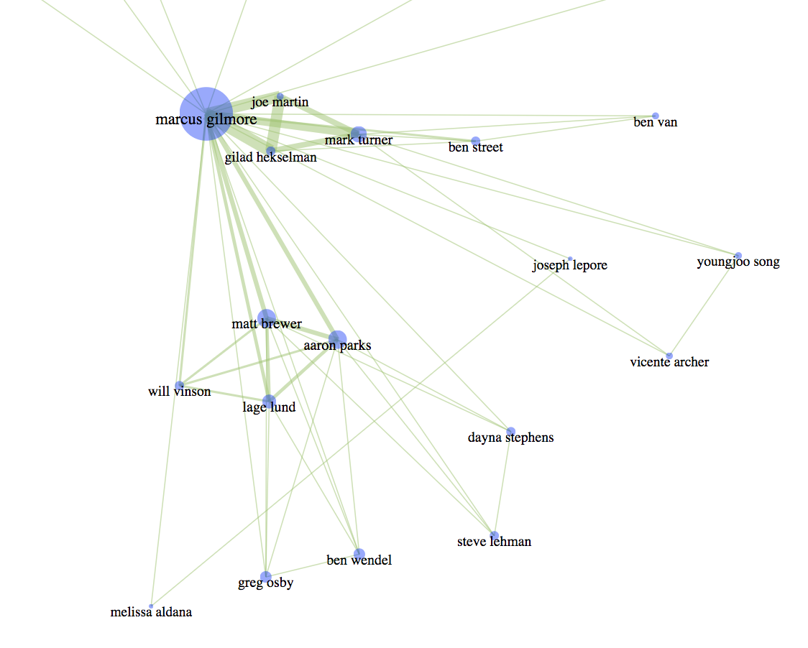

# Smalls-Network-Generator

This project is designed to, given an artist that has played at [Smalls jazz club](http://smallslive.com/) as input, create a network of people who play together. Smalls has an impressive record of shows from the last 10 years or so, most with full recordings on the site.

## Building the network
The [python script](/blob/master/networkgen.py) takes an artist as 
a starting point, finds (all by web scraping) the most recent (about 10) shows they played at smalls, and for those shows, finds the other artists on them, and documents the relationship of those artists to each other by creating or updating weighted edges in an undirected graph. This process repeats recursively for the size of the variable *iterations*. This script outputs .csv files for the edge list and node list of the network it just built.
## Visualizing the network 
Given the node/edge list from the script, I make visualizations of this network data with the javascript library [D3.js](d3js.org). Nodes with more questions have bigger bubbles and tend to be closer to the center of the network. The thicker the link between 2 artists nodes, the more shows they've played together on. A few visualizations with helpful zoom and pan options can be found [on my bl.ocks account](https://bl.ocks.org/klafleur).
## Why?
I wanted a new window into the current Jazz scene in new york. This project has led to me find a bunch of recordings and artists I would not have easily found otherwise.

### Examples

